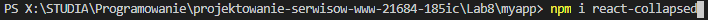
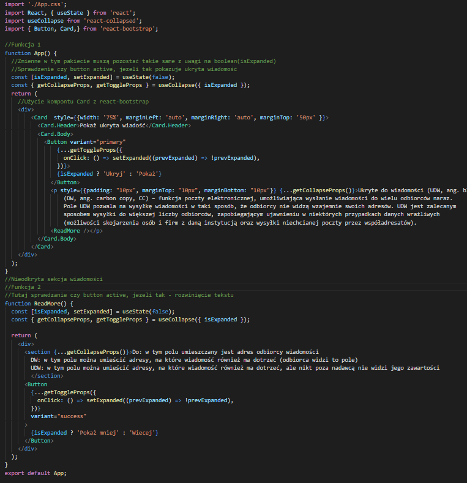
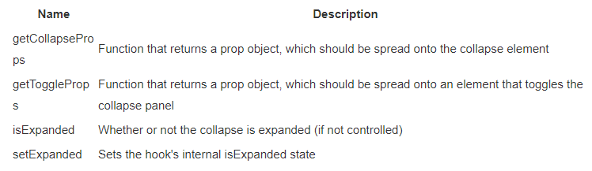
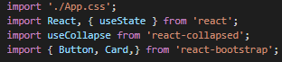
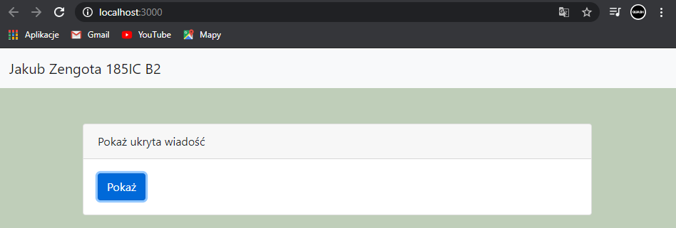
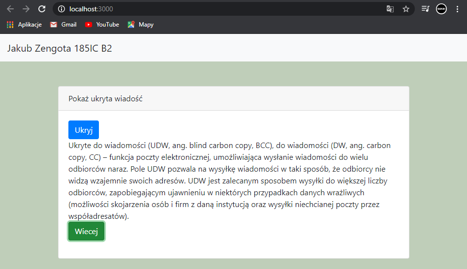
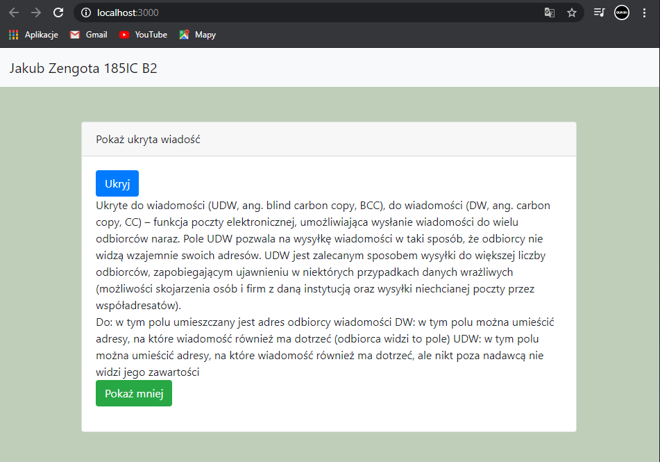
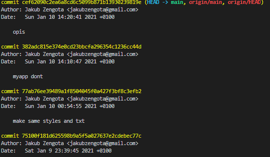
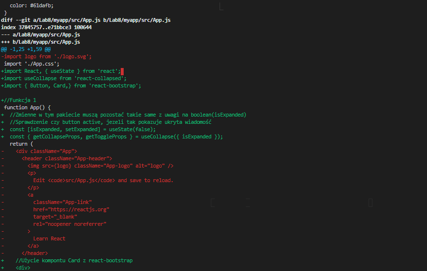
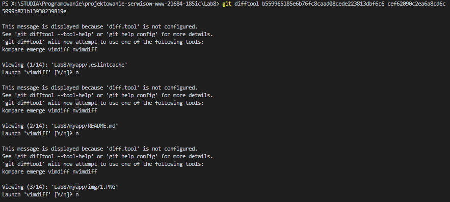

## react-collapsed install:

## Link do przykladu:

https://reactjsexample.com/a-react-custom-hook-for-creating-flexible-and-accessible-expand-collapse/

## Do mojego projektu, dodałem bootstrapowe komponenty do poprawienia wyglądu aplikacji.

## Kod apki:

## funkcje:

## importy:

## Wygląd aplikacji:

## Polecenie git diff słuzy do zobaczenia rożnic między commitami.

## czerwone - linia usunięta

## zielony - linia dodana

## Sprawdzmy róznice pomiędzy pierwszym a ostatnim commitem.

## Do tego potrzebujemy id commitów.

## Id commitów możemy łatwo sprawdzić poprzez wpisanie git log:

## git diff b559965185e6b76fc8caad08cede223813dbf6c6 77ab76ee39489a1f8504045f0a427f3bf8c3efb2

## Możemy użyć polecania git difftool, wybieramy tutaj zmiane dla danego pliku:

