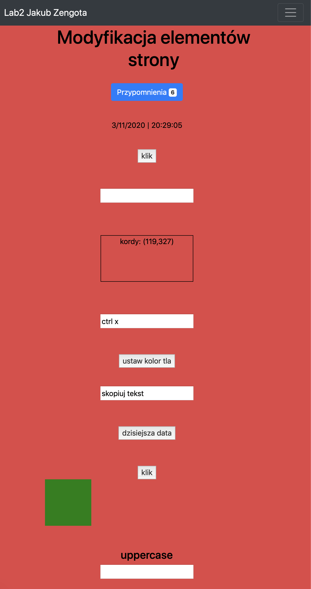

# Laboratorium nr 2 - modyfikacja elementów strony 

Stworzyłem responsywną stronę za pomocą Bootstrap framework wraz z róznymi opcjami modyfikacji elementów za pomocą js.

Przykłady uzycia strict mode:

