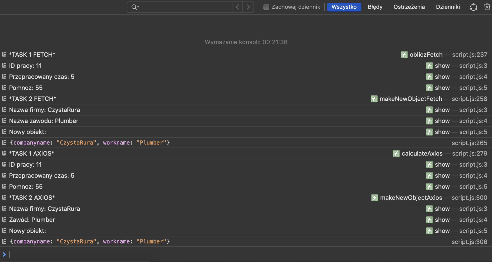

# Laboratorium nr 5 -  Asynchroniczny Java Script

Wygląd strony:

Plik db.json znajduje się u mnie na repo:

link do fake rest server :https://my-json-server.typicode.com/jakubzengota/projektowanie-serwisow-www-21684-185ic/users/

Wyniki zadań:

