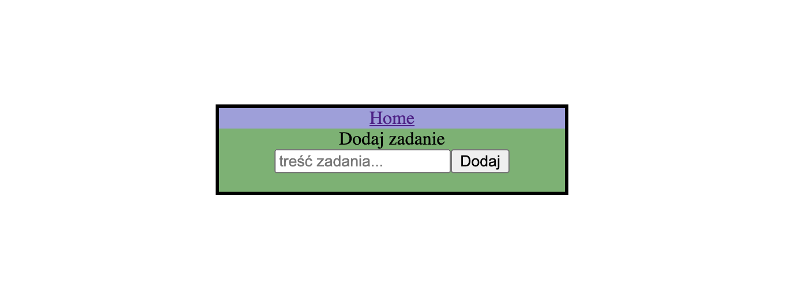
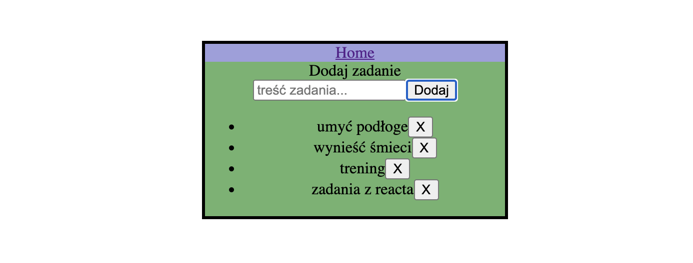
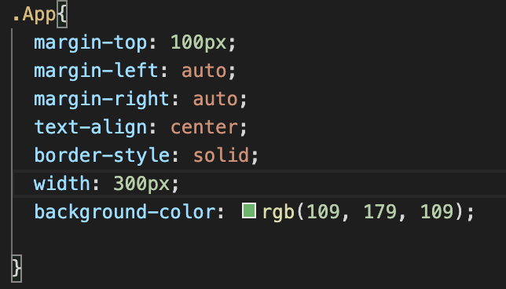
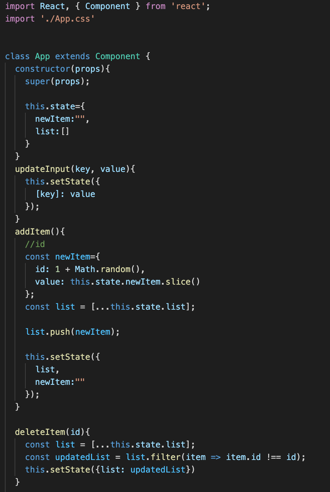
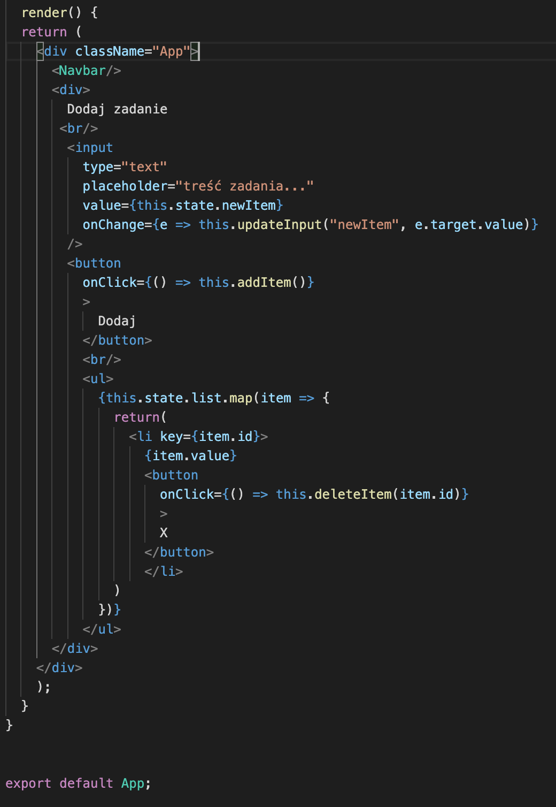
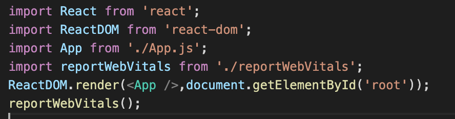

# Laboratorium nr 6 -  React 1 aplikacja

Utworzyłem prostą aplikację "To Do List" do tworzenia zadań do wykonania wraz z usuwaniem.
Wykorzystanie listy.

Wygląd strony:

Dodawanie zadań:

Dodawanie css:

Props / map:

Import:

