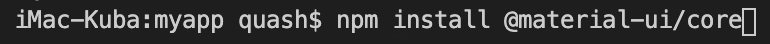
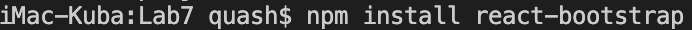
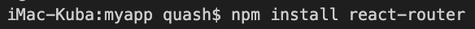

# Laboratorium nr 6 -  React 1 aplikacja

Utworzyłem prostą aplikację "To Do List" do tworzenia zadań do wykonania wraz z usuwaniem.
Wykorzystanie listy.

material-ui install:

bootstrap install:

react-router install:

npm start
sudo lsof -i :3000
sudo kill -9 2618

Stworzyłem responsywną stronę z 3 podstronami.