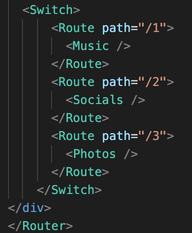
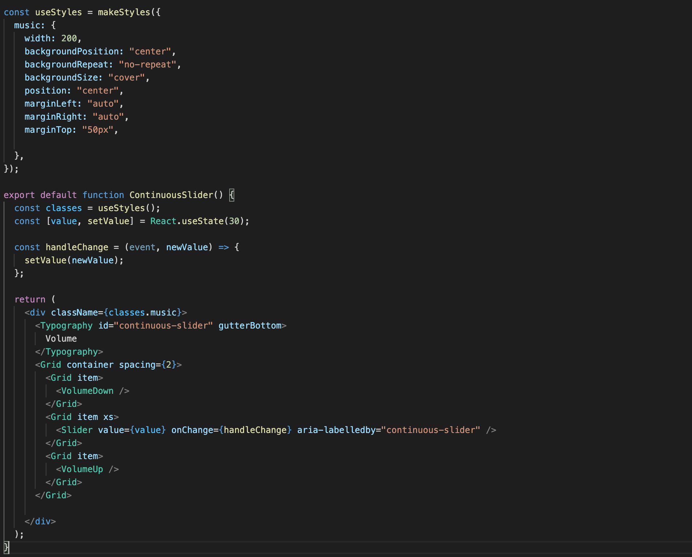
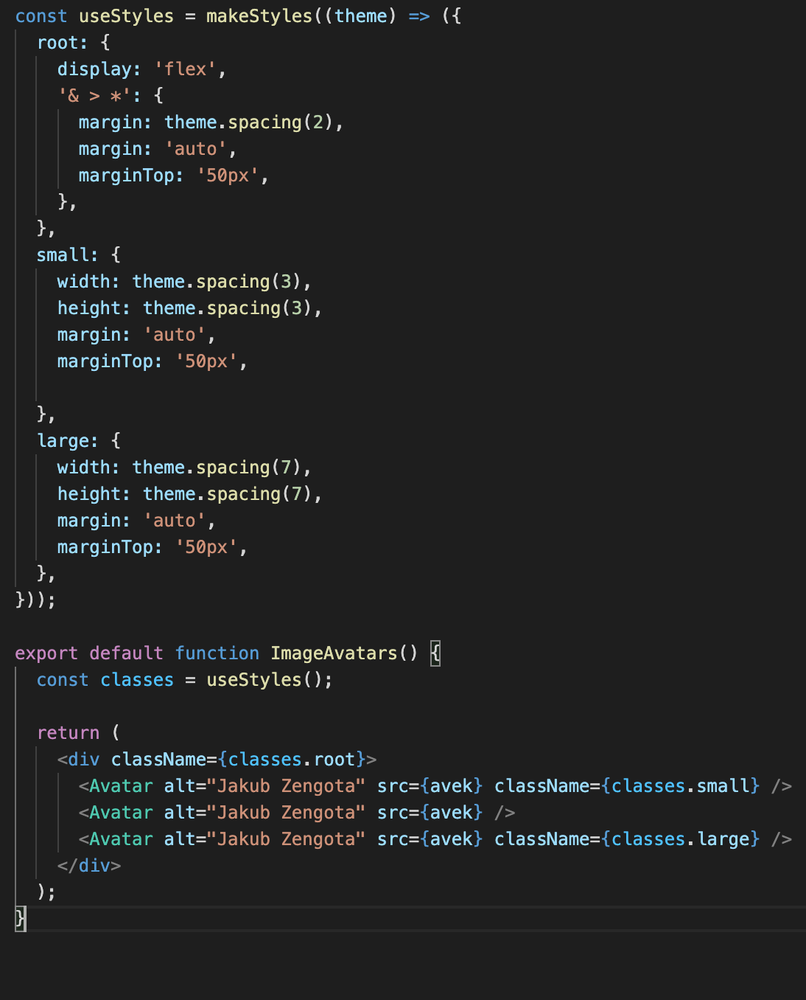

# Laboratorium nr 7 -  Material UI

Stworzyłem responsywną stronę z trzema podstronami wykorzystując wiele komponentów z biblioteki MaterialUI.

Ściezki:
localhost/3000/
localhost/3000/1/
localhost/3000/2/
localhost/3000/3/

material-ui install:

bootstrap install:

react-router install:

Switch/Link/Router:
Widoki trzech podstron zrealiwoałem za pomocą komponentu Cart wdrazając odpowiednie routy do "kafelek"

Wygląd strony startowej:

1 Podstrona - dodanie prostego slidera

2 Podstrona - widok avatarów w róznych wielkosciach

3 Podstrona - wyświetlanie obrazków w karuzeli

Moim skromnym zdaniem Material-ui bije na głowę bootstrapa. Jest o wiele bardziej przejrzysty, bardziej intuicyjny oraz wszystkie komponenty mozemy w łatwy sposób dostować do swoich wymagań

sudo lsof -i :3000
sudo kill -9 2618
