ygląd strony:
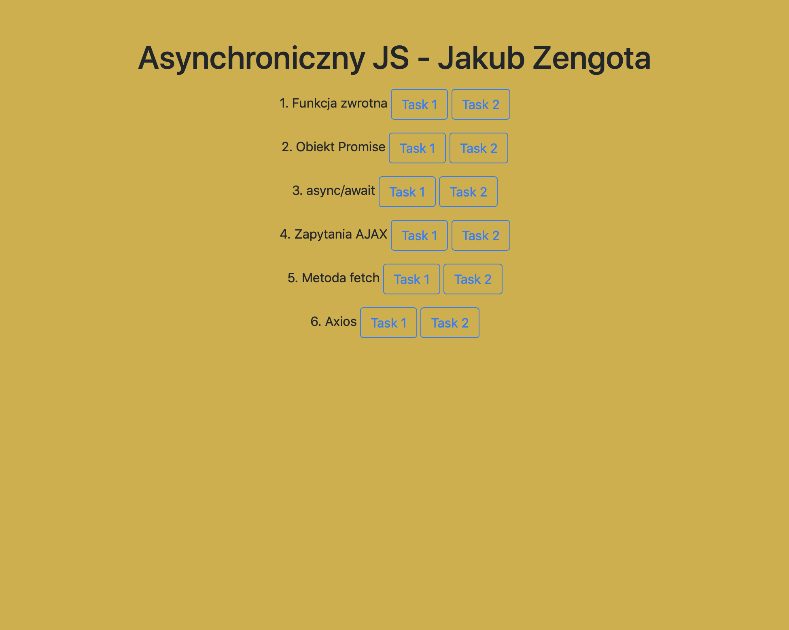

Plik db.json znajduje się u mnie na repo: https://github.com/jakubzengota/projektowanie-serwisow-www-21684-185ic/blob/main/db.json

link do fake rest server :https://my-json-server.typicode.com/jakubzengota/projektowanie-serwisow-www-21684-185ic/users/
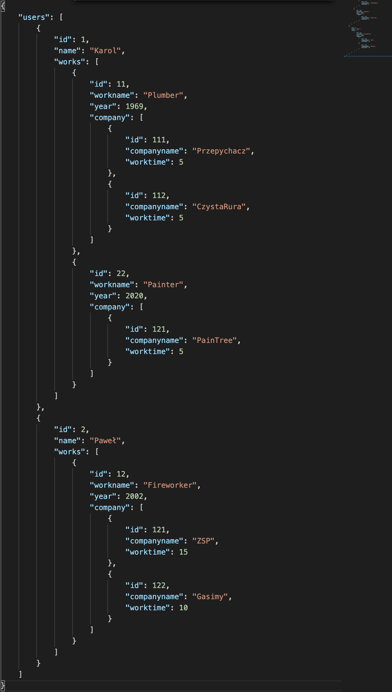

Wyniki zadań:
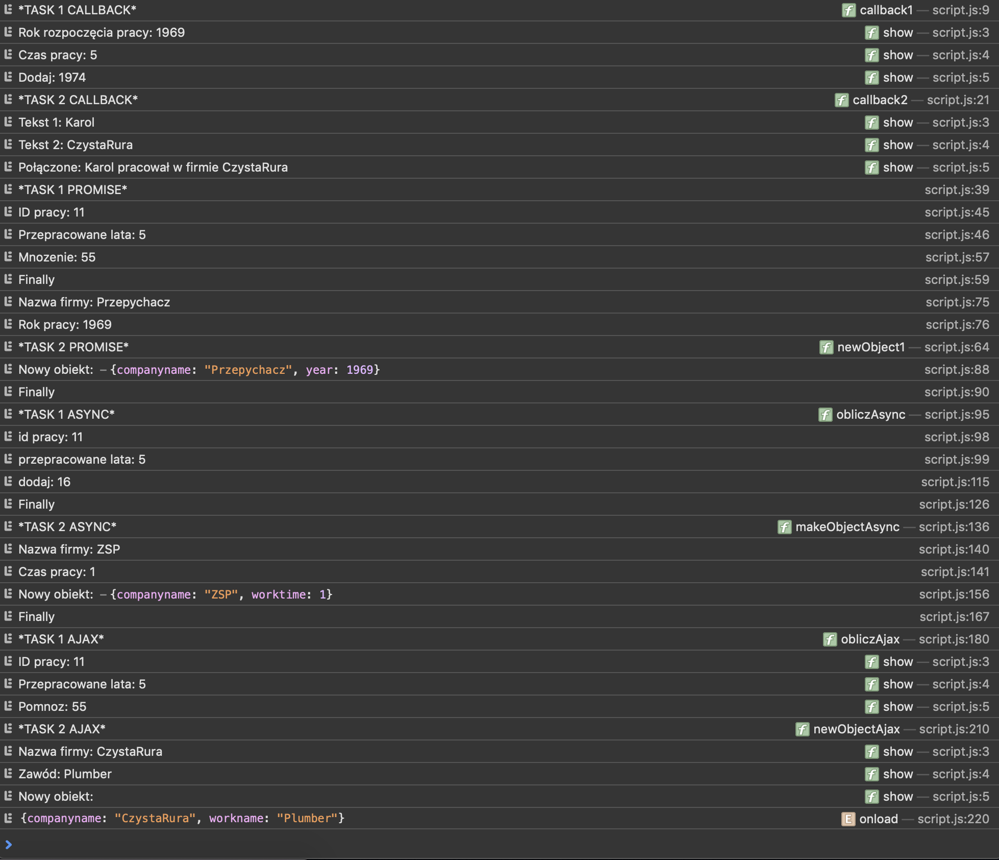
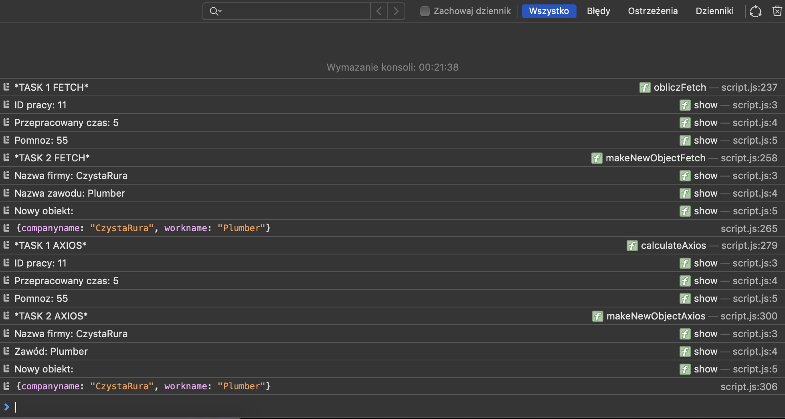

Kody do zadan:
1.funkcja zwrotna (callback)
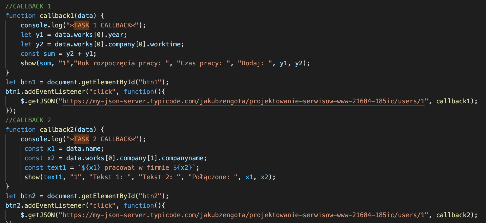
2.obiekt Promise (resolve, reject) z metodami then(), catch() i finally() + axios (lub fetch)
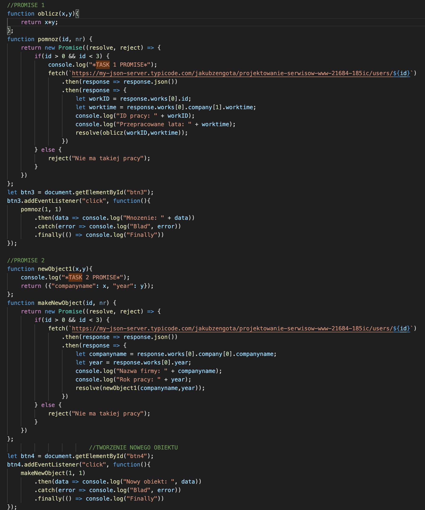
3.async/await + fetch (lub axios)
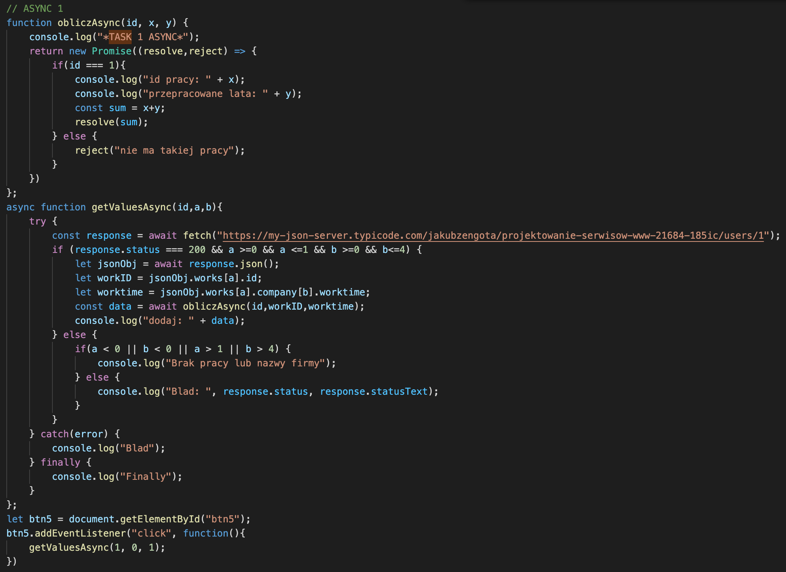
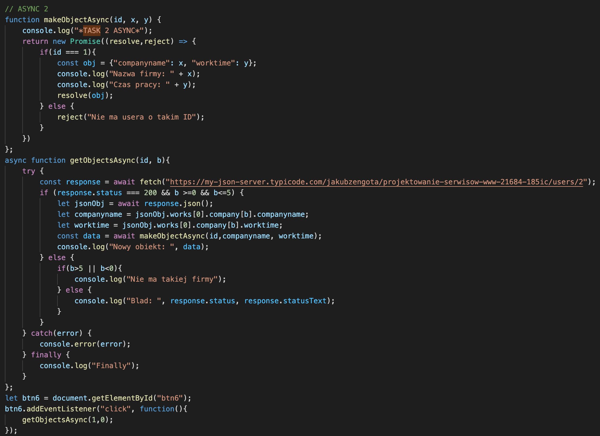
4.Zapytania AJAX
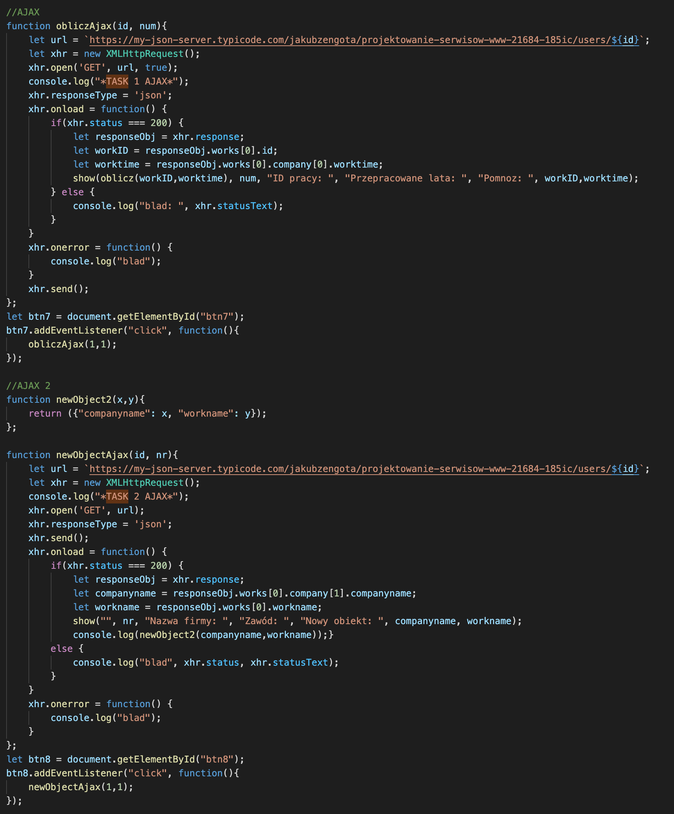
5.metoda fetch
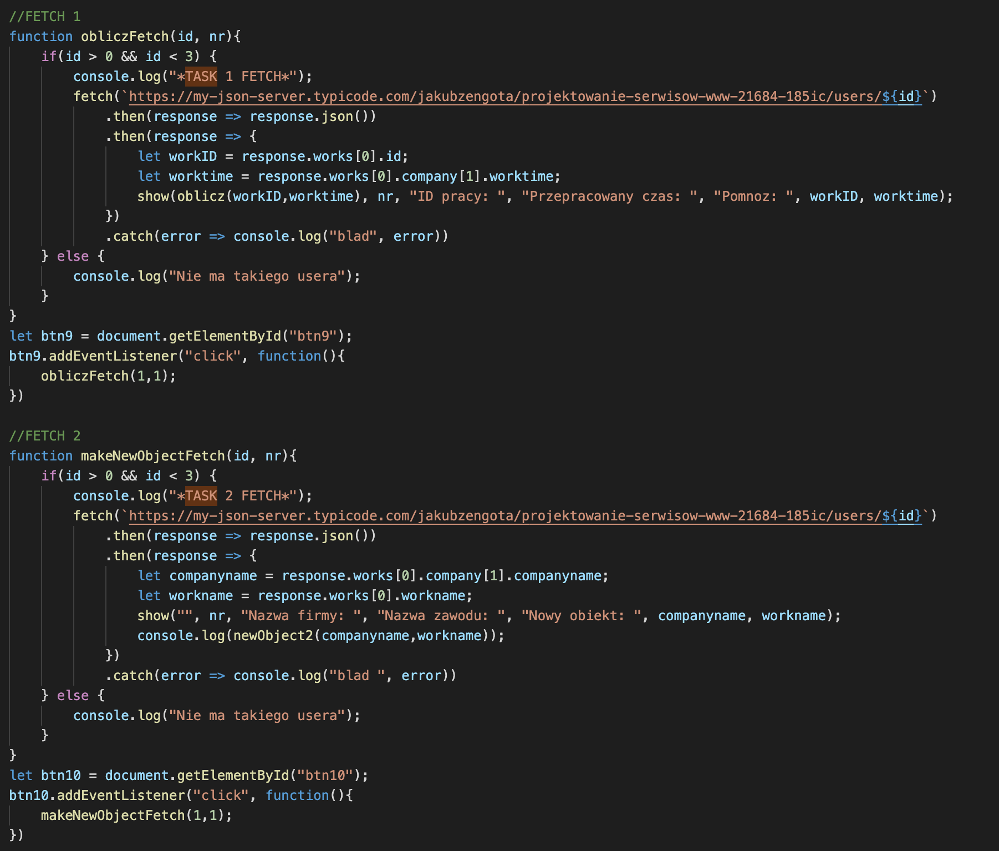
6.bibliotexa axios
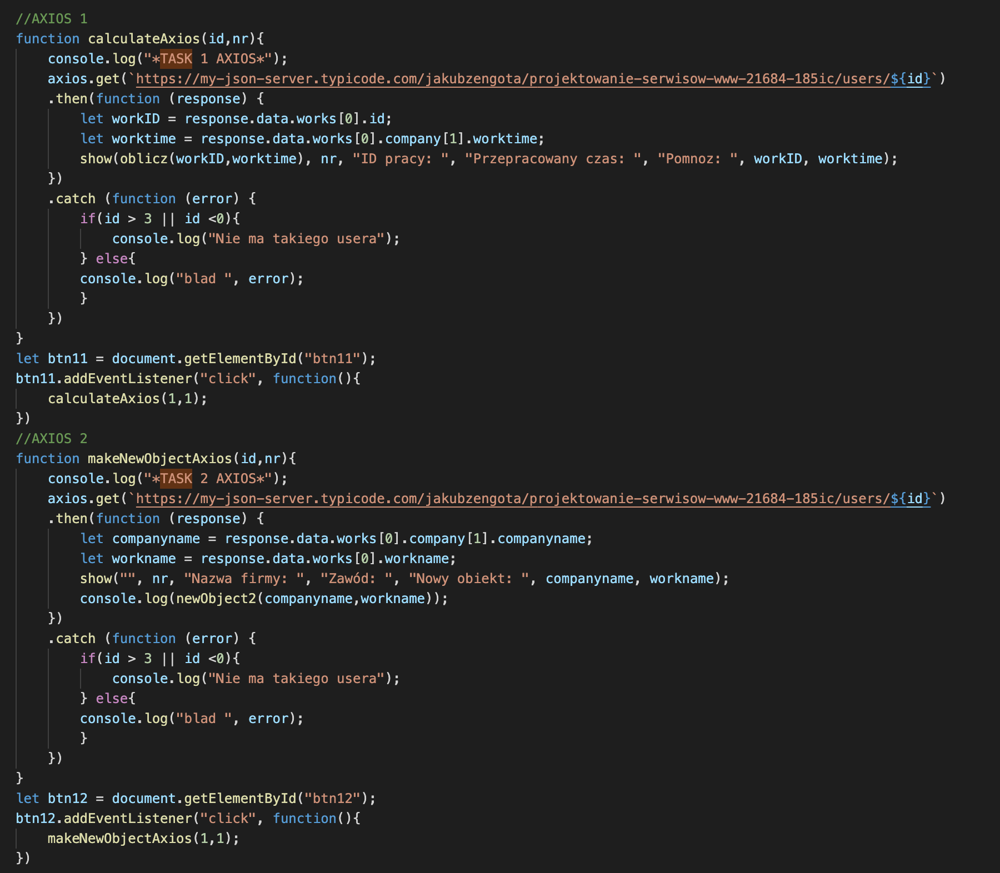
